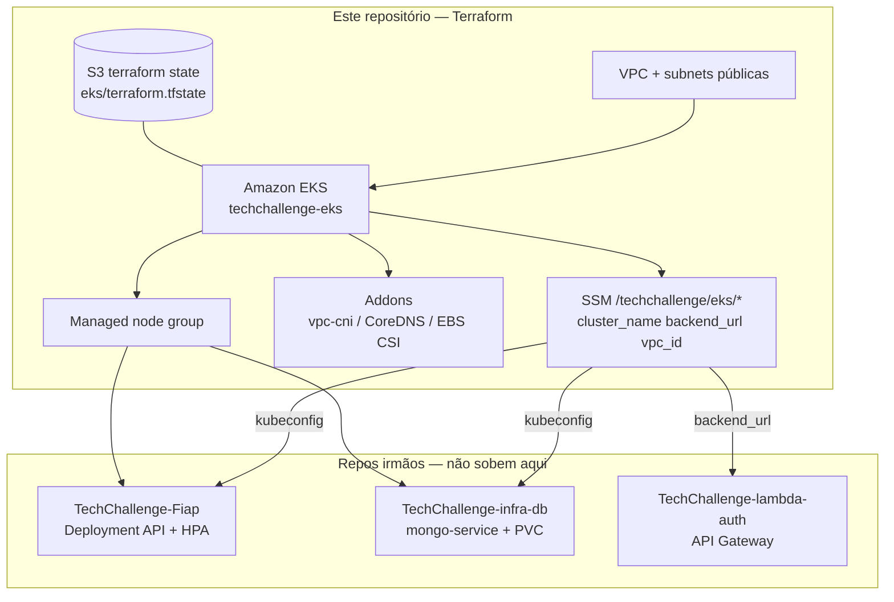

# TechChallenge-infra-eks

Infraestrutura Kubernetes da **oficina Node-Fiap** em Terraform: VPC, cluster Amazon EKS, node group, addons e parâmetros SSM para os repositórios irmãos.

Este repositório entrega **somente o cluster**. API, login JWT e Mongo vivem nos [repositórios irmãos](#repositórios-irmãos).

> **Não aplique este stack contra o state de produção (`eks/terraform.tfstate`) enquanto o monorepo [TechChallenge-Fiap](https://github.com/RuannGodinho/TechChallenge-Fiap) ainda gerenciar o cluster.** O backend padrão usa `split/eks/terraform.tfstate`. O workflow recusa a key de produção.

## Propósito

- Provisionar a VPC, o EKS e o node group usados pela API e pelo Mongo in-cluster.
- Publicar no SSM o contrato que os outros repos leem (`cluster_name`, `backend_url`, subnets, security group).
- Manter o state Terraform isolado no bucket compartilhado (`eks/terraform.tfstate` após o cutover).

Decisões: [RFC-001](docs/rfcs/001-adocao-aws.md), [RFC-007](docs/rfcs/007-orquestracao-eks.md), [RFC-008](docs/rfcs/008-nodeport-sem-alb.md), [RFC-010](docs/rfcs/010-terraform-iac.md).

## Tecnologias

| Camada | Tecnologia |
|---|---|
| Nuvem | AWS (`us-east-1`) |
| Rede | VPC, subnets públicas, security groups |
| Orquestração | Amazon EKS + managed node group |
| Addons | vpc-cni, CoreDNS, EBS CSI |
| Config | SSM Parameter Store `/techchallenge/eks/*` |
| Estado | S3 (`use_lockfile`) |
| IaC | Terraform 1.11 |
| CI/CD | GitHub Actions (CI + Terraform manual + bootstrap) |

## Arquitetura deste repositório

O que **este** repo cria. Workloads da API e do Mongo são `kubectl` em outros repos.



Diagrama da solução inteira: [componentes no Fiap](https://github.com/RuannGodinho/TechChallenge-Fiap/blob/main/docs/ARQUITETURA-COMPONENTES.md). Passo a passo do state: [docs/TERRAFORM.md](docs/TERRAFORM.md).

## Requisitos

- Terraform 1.11
- AWS CLI configurada (conta com permissão de EKS, VPC, IAM, SSM, S3)
- Arquivos `terraform.tfvars` e `backend.hcl` a partir dos `.example`
- Bucket S3 de state (workflow **Terraform Bootstrap**, ou o bucket já existente do monorepo)

Não precisa de Node, Docker nem kubectl para o *apply* deste repo. `kubectl` entra só depois, nos repos da API e do banco.

## Execução local

```text
*.tf                  # VPC, cluster, storage, SSM, outputs
bootstrap/            # bucket S3 do state (uma vez)
docs/                 # RFCs, ADRs, TERRAFORM.md
```

```bash
cp terraform.tfvars.example terraform.tfvars
cp backend.hcl.example backend.hcl   # ajustar bucket
terraform init -backend-config=backend.hcl
terraform fmt -check -recursive
terraform validate
terraform plan
```

### Contratos publicados no SSM

Prefixo padrão `/techchallenge`:

- `/techchallenge/eks/cluster_name`
- `/techchallenge/eks/aws_region`
- `/techchallenge/eks/vpc_id`
- `/techchallenge/eks/public_subnet_ids`
- `/techchallenge/eks/node_security_group_id`
- `/techchallenge/eks/backend_url` — `http://<node-public-ip>:30080`

## Deploy

1. Bootstrap do bucket (se ainda não existir): workflow **Terraform Bootstrap** — **não** rode apply se o bucket já existe.
2. `terraform apply` deste repo (local ou workflow **Terraform** com `confirm=yes`).
3. Só então: Mongo (`TechChallenge-infra-db`) → API (`TechChallenge-Fiap`) → Gateway (`TechChallenge-lambda-auth`).

```bash
terraform apply
aws eks update-kubeconfig --region us-east-1 --name techchallenge-eks
kubectl get nodes
```

`TF_STATE_KEY` deve ser `split/eks/terraform.tfstate` até o cutover; depois `eks/terraform.tfstate`. Detalhe: [docs/TERRAFORM.md](docs/TERRAFORM.md).

## Pipeline

| Workflow | Gatilho | Efeito |
|---|---|---|
| CI (`.github/workflows/ci.yml`) | push/PR | `terraform fmt` + `validate` (sem backend) |
| Terraform Bootstrap | `workflow_dispatch` | bucket S3 de state |
| Terraform | `workflow_dispatch` plan / apply / destroy | `apply` e `destroy` exigem `confirm=yes` |

### Secrets / variables

- `AWS_ACCESS_KEY_ID`, `AWS_SECRET_ACCESS_KEY`
- `TF_STATE_BUCKET` ou `TF_BACKEND_HCL`
- `TF_AWS_REGION` (default `us-east-1`)
- `TF_STATE_KEY` — `split/eks/terraform.tfstate` até o cutover

## Repositórios irmãos

| Repositório | Papel |
|---|---|
| [TechChallenge-Fiap](https://github.com/RuannGodinho/TechChallenge-Fiap) | API Node + manifests K8s |
| [TechChallenge-lambda-auth](https://github.com/RuannGodinho/TechChallenge-lambda-auth) | JWT + API Gateway |
| [TechChallenge-infra-db](https://github.com/RuannGodinho/TechChallenge-infra-db) | Mongo no EKS + Atlas opt-in |

## Documentação

| Documento | Conteúdo |
|---|---|
| [docs/](docs/README.md) | Índice deste repo |
| [TERRAFORM.md](docs/TERRAFORM.md) | Bootstrap S3, state, apply |
| [RFC-001](docs/rfcs/001-adocao-aws.md) / [ADR-001](docs/adrs/001-adocao-aws.md) | Adoção AWS |
| [RFC-007](docs/rfcs/007-orquestracao-eks.md) / [ADR-007](docs/adrs/007-orquestracao-eks.md) | EKS |
| [RFC-008](docs/rfcs/008-nodeport-sem-alb.md) / [ADR-008](docs/adrs/008-nodeport-sem-alb.md) | NodePort sem ALB |
| [RFC-010](docs/rfcs/010-terraform-iac.md) / [ADR-010](docs/adrs/010-terraform-iac.md) | Terraform |
| [Índice da solução](https://github.com/RuannGodinho/TechChallenge-Fiap/blob/main/docs/ARQUITETURA.md) | Checklist do enunciado |
