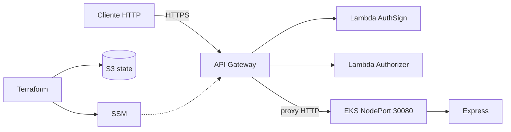

# RFC – Adoção da AWS como nuvem da solução

**Casa:** [TechChallenge-infra-eks](https://github.com/RuannGodinho/TechChallenge-infra-eks). Auth: [RFC-003 no lambda-auth](https://github.com/RuannGodinho/TechChallenge-lambda-auth/blob/main/docs/rfcs/003-autenticacao-jwt-api-gateway.md). Banco: [RFC-002 no infra-db](https://github.com/RuannGodinho/TechChallenge-infra-db/blob/main/docs/rfcs/002-mongodb-persistencia.md).

| Campo | Valor |
|---|---|
| **Número** | 001 |
| **Data** | 21/08/2026 |
| **Autor** | Ruann Correa Godinho |
| **Status** | Encerrada – Aprovada |
| **ADR** | [ADR-001](../adrs/001-adocao-aws.md) |

## Resumo

Adotar a **Amazon Web Services (região `us-east-1`)** como nuvem da Node-Fiap, usando API Gateway, Lambda, EKS, SSM, S3 e CloudWatch. O objetivo é entregar a API de oficina em um ambiente reproduzível, com custo de laboratório controlado e o mesmo artefato Docker em local e produção.

## Problema

A API de gestão de oficinas (clientes, veículos, OS, estoque e orçamentos) precisa sair do `docker compose` local e rodar em nuvem para cumprir o Tech Challenge: containerização, orquestração, autenticação na borda, persistência e CI/CD.

Sem um provedor definido, cada entrega (cluster, JWT, banco, state do Terraform) tenderia a soluções avulsas — VM única, PaaS diferente da orquestração, secrets em arquivos. Isso gera retrabalho, custo imprevisível e arquitetura difícil de explicar no onboarding.

As restrições do laboratório são explícitas: conta de estudante, Free Tier / créditos limitados, operação por uma pessoa e necessidade de IaC versionada.

## Proposta técnica

Usar **AWS** como plataforma única, com responsabilidades separadas por serviço (e, nesta branch, por repositório):

| Papel | Serviço AWS | Onde vive |
|---|---|---|
| Entrada HTTPS e auth | API Gateway HTTP API + Lambdas | `TechChallenge-lambda-auth` |
| Runtime da API | Amazon EKS (`techchallenge-eks`) | `TechChallenge-infra-eks` + manifests `k8s/` |
| Exposição do pod | Service NodePort `30080` (sem ALB/Ingress) | `k8s/Api-service.yml` |
| Configuração | SSM Parameter Store (`/techchallenge/eks/*`) | Terraform EKS |
| Estado da infra | S3 (backend remoto do Terraform) | bootstrap |
| Auditoria de auth | CloudWatch Logs das Lambdas | API Gateway / Lambda |
| Disco do Mongo in-cluster | EBS `gp2` via CSI | `k8s/mongo/` |

O cliente HTTP **não** fala com o node diretamente no desenho de produção: o tráfego entra no API Gateway, que autentica o JWT e faz proxy HTTP para a URL publicada no SSM (`backend_url`).

A escolha de **NodePort** em vez de Ingress/ALB é deliberada: reduz custo no laboratório e mantém a API acessível pelo IP público do node, sem Load Balancer cobrado por hora.

Região: **`us-east-1`** (maior oferta de Free Tier, imagens e documentação).

## Impacto esperado

**Ganhos**

- Um provedor cobre borda (Gateway + Lambda), orquestração (EKS), identidade de infra (IAM), parâmetros (SSM) e logs (CloudWatch).
- Infra como código (Terraform) e o mesmo `Dockerfile` em local e cluster.
- Separação de repositórios: app, EKS, auth e DB gerenciado evoluem com ciclos distintos.

**Riscos e restrições**

- EKS tem custo de control plane (~US$ 0,10/h) mesmo com 1 node; o laboratório precisa destruir o cluster quando ocioso.
- NodePort expõe o IP do node; a segurança da API depende do Gateway + `x-gateway-trust`, não de uma rede privada com ALB interno.
- Vendor lock-in moderado nos serviços de borda (authorizer do API Gateway, SSM). O domínio da aplicação permanece em Node.js/Express e não conhece AWS (Clean Architecture).
- Operação exige `kubectl`, AWS CLI e contas IAM corretas — curva maior que um PaaS de um clique.

**Custo (laboratório)**

- Control plane EKS + 1 node t3 + EBS 1 Gi + Lambdas (quase zero em volume de aula) + API Gateway HTTP API.
- Sem ALB e sem NAT Gateway extras no desenho mínimo, de propósito.

## Alternativas consideradas

| Alternativa | Por que foi descartada |
|---|---|
| **Microsoft Azure** (AKS + APIM + Functions) | Stack equivalente, porém o material do curso, o SAM CLI e a maior parte dos exemplos de authorizer JWT apontam para AWS. Trocar o provedor não reduz complexidade e aumenta atrito de documentação. |
| **Google Cloud** (GKE + Cloud Run + API Gateway) | GKE e Cloud Run são sólidos; o recorte do challenge pede Kubernetes + auth na borda, e o time já tem credenciais/CLI AWS. |
| **PaaS único** (Elastic Beanstalk, App Runner, Render) | Entrega rápida, mas esconde orquestração, HPA e manifests — exatamente o que a fase pede para demonstrar. |
| **VM única** (EC2 + Docker Compose) | Barato e simples, porém sem cluster, autoscaling nem separação de auth serverless. Não atende o entregável de Kubernetes. |
| **Multicloud** (API na AWS + banco em outro provedor sem necessidade) | Complexidade operacional sem ganho neste recorte; Atlas (fora da AWS) entra só como persistência gerenciada opt-in, não como segunda nuvem de compute. |

## Pontos em aberto

- Cutover do Mongo in-cluster para Atlas (`enable_managed_db=true`) continua opt-in — ver [RFC-002](https://github.com/RuannGodinho/TechChallenge-infra-db/blob/main/docs/rfcs/002-mongodb-persistencia.md).
- Substituir NodePort por Ingress/ALB se o laboratório ganhar orçamento ou exigir TLS terminado em load balancer — ver [RFC-008](008-nodeport-sem-alb.md).
- Encerrar o cluster automaticamente fora do horário de demo para conter o custo do control plane.
