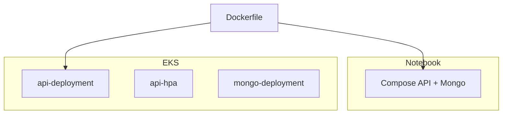

# RFC – Orquestração da API no Amazon EKS

**Casa:** Terraform do cluster neste repo. Manifests da API (`k8s/`) e HPA: [TechChallenge-Fiap](https://github.com/RuannGodinho/TechChallenge-Fiap).

| Campo | Valor |
|---|---|
| **Número** | 007 |
| **Data** | 21/08/2026 |
| **Autor** | Ruann Correa Godinho |
| **Status** | Encerrada – Aprovada |
| **ADR** | [ADR-007](../adrs/007-orquestracao-eks.md) |

## Resumo

Rodar a API e o Mongo de laboratório em **Amazon EKS** (`techchallenge-eks`, `us-east-1`), com manifests em `k8s/` e HPA. Compose permanece só para desenvolvimento local.

## Problema

O challenge pede containerização **e** orquestração: restart automático, várias réplicas, persistência além do ciclo de vida do processo. `docker compose` no EC2 não demonstra cluster, Service, PVC nem autoscaling.

A orquestração precisa coexistir com a borda no API Gateway ([RFC-001](001-adocao-aws.md), [RFC-003](https://github.com/RuannGodinho/TechChallenge-lambda-auth/blob/main/docs/rfcs/003-autenticacao-jwt-api-gateway.md)): o pod é backend, não a entrada pública.

## Proposta técnica

Cluster EKS gerenciado, namespace `default`:

- `api-deployment` — imagem `ruanngodinho/techchallenge:latest`, porta 3000
- `api-service` — exposição (detalhe na [RFC-008](008-nodeport-sem-alb.md))
- `api-hpa` + `metrics-server` — [RFC-012 no Fiap](https://github.com/RuannGodinho/TechChallenge-Fiap/blob/main/docs/rfcs/012-hpa-observabilidade.md)
- Mongo in-cluster + PVC até o cutover Atlas ([RFC-002 no infra-db](https://github.com/RuannGodinho/TechChallenge-infra-db/blob/main/docs/rfcs/002-mongodb-persistencia.md))
- ConfigMap / Secrets, Job de seed

Infra do cluster (VPC, nodes, EBS CSI, kubeconfig) **neste** repo. Workloads da aplicação no [TechChallenge-Fiap](https://github.com/RuannGodinho/TechChallenge-Fiap) (`kubectl apply` no CD).

Local: `docker compose up` — mesmo Dockerfile, sem Kubernetes.

## Impacto esperado

**Ganhos**

- Artefato único (imagem) em local e produção.
- Restart, rollout e HPA nativos.
- Manifests versionados; o CD é declarativo.

**Riscos e restrições**

- Control plane EKS tem custo fixo com o cluster ligado.
- Operação (`kubectl`, IAM, addon CSI) é mais pesada que ECS/Fargate “clique para deploy”.
- Um node de laboratório não prova multi-AZ; HA do control plane não é HA da aplicação.

## Alternativas consideradas

| Alternativa | Por que foi descartada |
|---|---|
| **Amazon ECS / Fargate** | Orquestra containers sem kubectl. O entregável pede Kubernetes (manifests, HPA, Service). |
| **EKS Auto Mode / Fargate profiles** | Menos node para gerenciar, mais custo e menos visibilidade pedagógica do Pod/PVC. |
| **Somente Docker Compose na EC2** | Barato; não cobre cluster, HPA nem Service. |
| **Kubernetes self-managed** (kubeadm em EC2) | Ensino de control plane demais para o prazo; EKS entrega a API do K8s gerenciada. |
| **OpenShift / k3s em outro cloud** | Fora da [RFC-001](001-adocao-aws.md). |

## Pontos em aberto

- Tamanho do node e uso de Spot para conter custo.
- Namespace dedicado (`oficina`) em vez de `default`.
- Quando o Atlas estiver ativo, remover o Deployment Mongo do cluster sem quebrar o CD.
